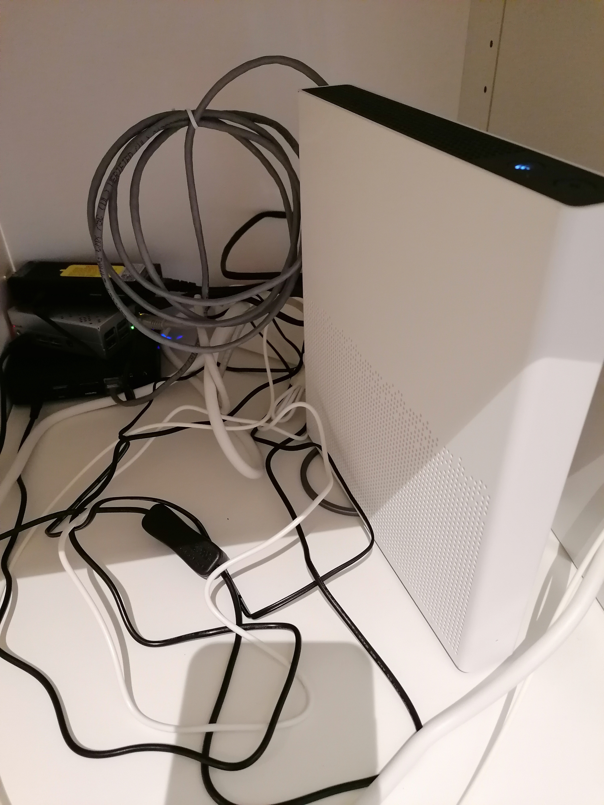
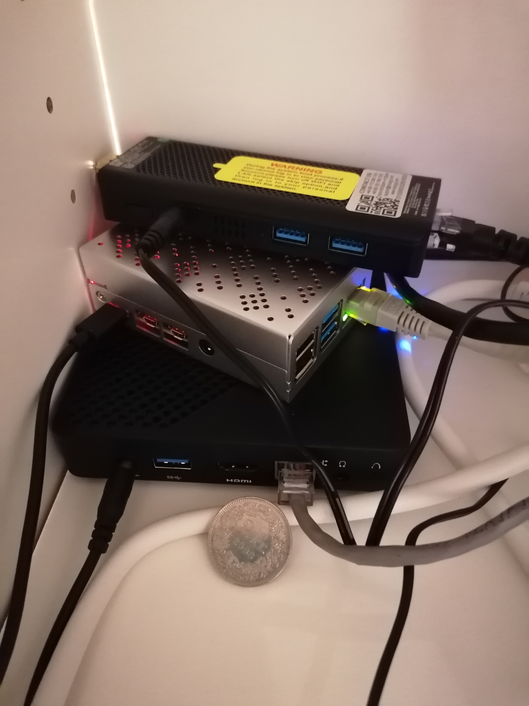
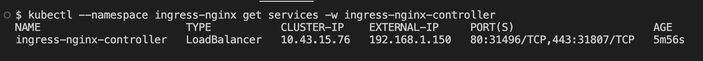
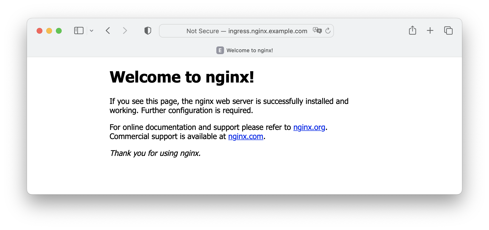
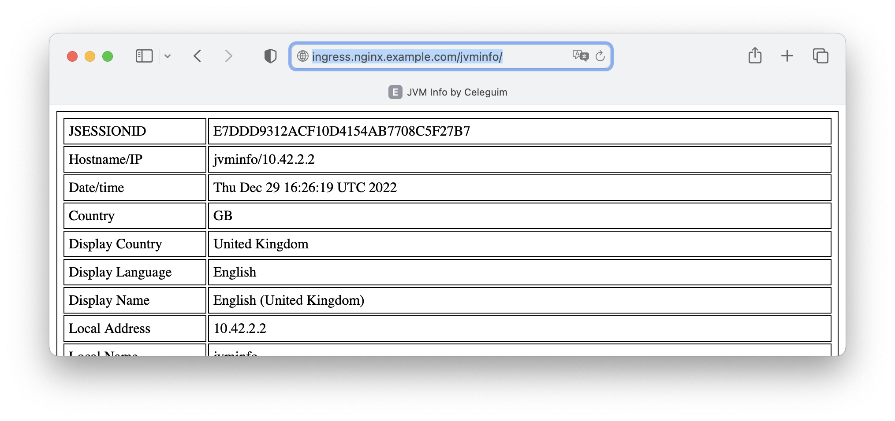

## Goal

Build a light-weight bare metal kubernetes cluster with k3sup and k3s (https://github.com/alexellis/k3sup)

The k3s cluster will have a load balancer (MetalLB) and ingress controller (NGINX) working together

## Inventory

Bare metal setup


<br>

| role   |      ip       |   user   |           device | cpu | mem |        proc |
| :----- | :-----------: | :------: | ---------------: | :-: | :-: | ----------: |
| master | 192.168.1.180 | celeghin | OKDO-RASPBERRYPI |  4  | 4GB | arm aarch64 |
| node1  | 192.168.1.182 | celeghin |     NIPOGI-J4125 |  4  | 6GB | intel j4125 |
| node2  | 192.168.1.183 | celeghin | MINISFORUM-N4020 |  2  | 4GB | intel n4020 |

## My Datacenter

The router


<br>
<br>

The braves


<br>
<br>

## Pre-reqs

[](./pre-reqs.txt)

- set hostname
- install curl k3sup net-tools
- ssh passwordless
- disable ipv6 and swap
- permanent ipv4 / nmplan

## K3s installation

### Install master

As we don't want to have the default integrated traefik, but instead we want to have MetalLB as load balancer and NGINX as ingress controller, so we must disable it on the installation, like:

```
USER=celeghin
MASTER=192.168.1.180
CLUSTER=k3s-cluster

k3sup install --cluster --k3s-extra-args '--disable traefik,servicelb,metrics-server' \
 --ip ${MASTER} --user ${USER} --merge --local-path $HOME/.kube/config \
 --context ${CLUSTER} --k3s-channel stable

```

Just wait a bit and your cluster will be kicking up, at this point you just have the master

```
export KUBECONFIG=~/.kube/config
kubectl config use-context ${CLUSTER}
kubectl get node -o wide
kubectl get all -n kube-system
```


<br>
<br>

### Join the nodes

Repeat for node1 and node2

```
USER=celeghin
MASTER=192.168.1.180
NODE=192.168.1.183
CLUSTER=k3s-cluster
k3sup join --host ${NODE} --user ${USER} --server-host ${MASTER} --k3s-channel stable
```


<br>
<br>

## Install MetalLB Load Balancer

https://metallb.universe.tf/

Current version: 0.13.7

```
kubectl apply -f metallb-native-0.13.7.yaml
kubectl get all -n metallb-system
```

Wait until MetalLB is completed (all resources) and create a pool of IPs (MetalLB needs a range of free IPs), check metallb-pool.yaml:


<br>
<br>

```
kubectl apply -f metallb-pool.yaml
```

## Test MetalLB Load Balancer

**Test1**

```
kubectl create deployment nginx --image nginx
kubectl expose deployment nginx --type LoadBalancer --port 80 --name nginx

kubectl get services
NAME         TYPE           CLUSTER-IP      EXTERNAL-IP     PORT(S)        AGE
kubernetes   ClusterIP      10.43.0.1       <none>          443/TCP        35m
nginx        LoadBalancer   10.43.155.102   192.168.1.148   80:31611/TCP   57s

# The test1 service was exposed with the first external IP in the pool

```

http://192.168.1.148/

<br>

**Test2**

```
kubectl run jvminfo --image celeguim/jvminfo:latest
kubectl expose pod/jvminfo --port 80 --target-port=8080 --type LoadBalancer
kubectl get services

NAME         TYPE           CLUSTER-IP      EXTERNAL-IP     PORT(S)        AGE
jvminfo      LoadBalancer   10.43.86.184    192.168.1.149   80:32494/TCP   27s
kubernetes   ClusterIP      10.43.0.1       <none>          443/TCP        41m
nginx        LoadBalancer   10.43.155.102   192.168.1.148   80:31611/TCP   7m15s

# The test2 service was exposed with the second external IP in the pool

```

http://192.168.1.149/jvminfo/

<br>

## Install NGINX ingress controller

```
HELM_INSTALL_CMD="sudo /snap/bin/helm repo add ingress-nginx https://kubernetes.github.io/ingress-nginx ; \
sudo cp /etc/rancher/k3s/k3s.yaml /root/.kube/config ; \
sudo /snap/bin/helm upgrade --install ingress-nginx ingress-nginx \
--repo https://kubernetes.github.io/ingress-nginx \
--namespace ingress-nginx --create-namespace"

ssh celeghin@192.168.1.180 ${HELM_INSTALL_CMD}

# Watch for IP
kubectl --namespace ingress-nginx get services -o wide -w ingress-nginx-controller

# find running pod
podname=$(kubectl get pods -n ingress-nginx -l app.kubernetes.io/name=ingress-nginx --field-selector=status.phase==Running -o jsonpath='{.items[0].metadata.name}')

echo "Ingress Pod name: $podname"

# invoke controller with version flag
kubectl exec -it -n ingress-nginx $podname -- /nginx-ingress-controller --version

-------------------------------------------------------------------------------
NGINX Ingress controller
  Release:       v1.5.1
  Build:         d003aae913cc25f375deb74f898c7f3c65c06f05
  Repository:    https://github.com/kubernetes/ingress-nginx
  nginx version: nginx/1.21.6

-------------------------------------------------------------------------------

```

As you can see, now the cluster has an external load balancer 192.168.1.50



Don't forget to edit your /etc/hosts

```
$ grep ingress /etc/hosts
192.168.1.150   ingress.nginx.example.com
```

## Test NGINX ingress controller

```
kubectl apply -f ./apps/deploy.ingress.yaml
```

According to the design you have the host ingress.nginx.example.com serving two entry points

- / (for nginx test1)
  

- /jvminfo (for jvminfo test2)
  

And that's it.
