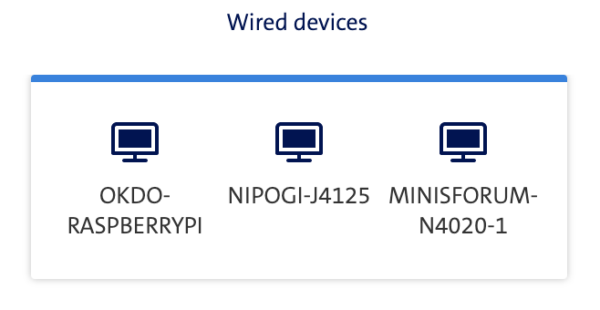

## Goal

Build a light-weight bare metal kubernetes cluster with k3sup / k3s
https://github.com/alexellis/k3sup

The k3s cluster will have a load balancer (MetalLB) and ingress controller (NGINX) working together

## Inventory

Bare metal setup

| role   |      ip       |   user   |           device | cpu | mem |        proc |
| :----- | :-----------: | :------: | ---------------: | :-: | :-: | ----------: |
| master | 192.168.1.180 | celeghin | OKDO-RASPBERRYPI |  4  | 4GB | arm aarch64 |
| node   | 192.168.1.182 | celeghin |     NIPOGI-J4125 |  4  | 6GB | intel j4125 |
| node   | 192.168.1.183 | celeghin | MINISFORUM-N4020 |  2  | 4GB | intel n4020 |

## Pre-reqs

- set hostname
- install curl k3sup net-tools
- ssh passwordless
- disable ipv6 and swap
- permanent ipv4 / nmplan
